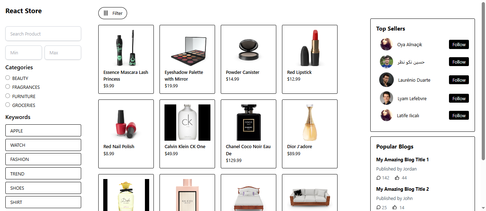

# React E-Commerce

A modern e-commerce web application built with **React**, **TypeScript**, **Tailwind CSS**, **React Router**, **Lucide React**, and **DummyJSON API** for fetching product data.

## Features

- 🛒 **Product Listing** - Displays products fetched from DummyJSON API.
- 🔍 **Product Details** - View detailed information about each product.
- 📍 **React Router** - Seamless navigation between pages.
- 🎨 **Tailwind CSS** - Responsive and stylish UI.
- 🔗 **Lucide Icons** - Elegant and lightweight icons.
- ⚡ **TypeScript** - Ensures type safety and better developer experience.
- 🔎 **Product Filtering**:
  - Search products by name.
  - Filter products using radio buttons.
  - Sort by price: **High to Low**, **Low to High**.
  - Sort by **Popularity**.
  - Sort by **Keywords**

## Tech Stack

- **React** (Vite)
- **TypeScript**
- **Tailwind CSS**
- **React Router**
- **Lucide React**
- **DummyJSON API** (https://dummyjson.com)

## Screenshots

Here are some screenshots from the website:




## Installation

1. Clone the repository:

   ```bash
   git clone https://github.com/Kelsen23/react-ecom.git
   cd react-ecom

2. Install Dependencies:
    npm install

3. Start the development server:
    npm run dev

## Contributing
  Feel free to submit issues or contribute by opening pull requests. 🎉

## License
  This project is licensed under the MIT License - see the [LICENSE](LICENSE) file for details.
